Here we list built-in applications of Gazel. Every application has _IoC Layer_
and _Application Layer_ by default.

- [__IoC Layer__](architecture#ioc-layer): This layer introduces dependency
  injection to all applications and base to all other layers.
- [__Application Layer__](architecture#application-layer): This layer manages
  `IApplicationBuilder` instance and handles `OnStart` and `OnStop`
  configurations.

## Service Application

Service application is designed to serve business functionality as internal
services. This application is currently the only one that provides a data
access layer. Below diagram illustrates a service application architecture;

It consists of three layers;

- [__Service Layer__](architecture#service-layer): This layer gets domain
  objects from IoC container and exposes your public methods as internal
  business services.
- [__Business Logic Layer__](architecture#business-logic-layer): This layer
  scans your module assemblies and registers them to IoC container.
- [__Data Access Layer__](architecture#data-access-layer): This layer gest
  persistent classes from IoC container and maps them to a database. This way
  it enables your application to communicate with an RDBMS.

### Features

- Audit
- Authentication
- Authorization
- Cache
- Crypto
- Decimal Point
- Exception Handling
- File System
- Hashing
- Localization
- Logging
- Message Queue
- Remote Call
- Secure Call
- Transaction
- Utc

## Middleware Application

Middleware Application consists of business modules without a data access layer
and exposes configured methods as RESTful endpoints. Below you can see an
architectural diagram of this application.

It consists of two layers;

- [__Rest Api Layer__](architecture#rest-api-layer): This layer contains
  runtime-generated controller classes which converts and forwards incoming
  messages to business services.
- [__Service Local Client Layer__](architecture#service-local-client-layer):
  This layer serves as an adapter between _Rest Api_ and _Business Logic_.
- [__Business Logic Layer__](architecture#business-logic-layer): This layer
  scans your module assemblies and registers them to IoC container.

Just like a service application you can create business modules but this time
without a Data Access Layer. This means that within this application, you are
expected to consume and orchestrate services from other systems.

### Features

- Audit
- Authentication
- Authorization
- Crypto
- Decimal Point
- Exception Handling
- File System
- Hashing
- Localization
- Logging
- Secure Call
- Utc

## Api Application

Api Application acts as an api gateway and exposes configured internal services
to be available publicly via RESTful endpoints. Below you can see architectural
diagram of this application.

- [__Rest Api Layer__](architecture#rest-api-layer): This layer contains
  runtime-generated service classes which converts and forwards incoming
  messages to service client layer.
- [__Service Client Layer__](architecture#service-client-layer): This layer
  accepts incoming messages, converts them to internal HTTP calls and redirects
  them to business services in a Service Application.

### Features

- Authentication
- Exception Handling
- Http Header
- File System
- Hashing
- Localization
- Logging
- Secure Call
- Utc

## Gateway Application

Gateway Application is designed to serve desktop or single-page web
applications that consumes directly internal business services. Unlike Api
Application, it does NOT transform HTTP messages between client and service
application. It only restricts client application to use a certain subset of
internal business services.

- [__Gateway Layer__](architecture#gateway-layer): This layer contains a
  ASP.NET Core middleware that forwards requests directly to the backing
  service application url. It can also restrict a service from consumption.
- [__Service Client Layer__](architecture#service-client-layer): This layer
  configures url of backing service application and passes it to gateway layer.

### Features

- Application Session
- Authentication
- Hashing
- Http Header
- Logging
- Utc

## Command Line Application

Command Line Application is designed to easily develop CLIs. Unlike other
applications it is not a web application. It only consists of a _Command Layer_;

- [__Command Line Layer__](architecture#command-line-layer): This layer scans
  application assembly to find implementations of `ICommand` interface and
  register command routing so that a CLI command is forwarded to the `Execute`
  method of your command classes.

### Features

- Exception Handling
- File System
- Localization
- Logging
