Gazel has a layer and feature system. In this system, layers and features form
a matrix which we call an application. This system allows you to create any
type of software architecture to suit different needs.

There are three concepts: _Application_, _Layer_ and _Feature_;

__An Application__ consists of layers and features. It is designed according to
an architectural pattern. For example, _Service Application_ consists of
_Service Layer_, _Business Logic Layer_ and _Data Access Layer_ whereas _Api
Application_ consists of _Rest Api Layer_ and _Service Client Layer_.

__A Layer__ introduces a new framework, library or SDK for an application to
have a base to be configured. For example, _Data Access Layer_ introduces
NHibernate, IoC Layer introduces Windsor and so on.

__A Feature__ configures one or more layers to make a certain functionality
available to your application. For example, the feature _Audit Option_
configures both _Service Layer_ and _Data Access Layer_, so that it can log
service requests as well as it adds audit columns to entities.

Assume we have an application with two layers and two features, below diagram
represents this application from layer perspective;

This is an application with two layers `A Layer` and `B Layer`, where `A Layer`
only has a configuration from `X Feature`, but `B Layer` has configurations
from both `X Feature` and `Y Feature`.

Let's look at the same application from feature perspective;

Here you can see that this is an application with two features; `X Feature` and
`Y Feature` with their configurations to relevant layers.

> :information_source:
>
> The difference between a layer and a feature is that a layer continue to
> exist without a configuration from a feature. So it only contains
> configurations from features. On the other hand, features consist of
> configurations, without them there won't be any features.

Finally you can see above application from application perspective;

---

Now that you have learned three basic concepts _Application_, _Layer_ and
_Feature_, it is time to move on to next section.
