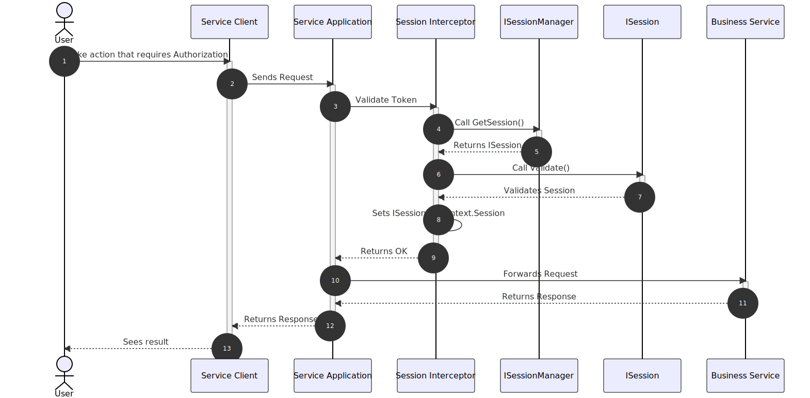

In this section, you will learn about how authentication is implemented in
Gazel.

Authentication is enabled by default in _Service Application_. All requests
from outside of your host project require an token. When you run your
`App.Service` project, you will see an `Authorization` text box in request
headers section which configures an HTTP authorization header for every
request.


Below you can see a sequence diagram explaining how gazel interacts with
your code through interfaces;



Here you can see that for every request;

- It first calls `GetSession()` to retrieve session object
- Then it invokes `Validate()` to enable validation logic
- If everything is ok, it sets your session object to request scope.

## `ISessionManager` interface

When authentication is enabled, Gazel requires an implementation of
`ISessionManager` interface. Once you implement it in any module, it will be
registered automatically.

`ISessionManager` is basically responsible for finding an `ISession` instance
 from a given `AppToken`. An example implementation is as follows;

```csharp
public class SessionManager : ISessionManager
{
    ...
    public ISession GetSession(AppToken appToken) =>
        _context.Query<Sessions>().SingleByAppToken(appToken);
    ...
}
```

> :information_source:
>
> If you don't want `GetSession` method to be public, you can implement
> `ISessionManager` explicitly.
>
> ```csharp
> public class SessionManager : ISessionManager
> {
>     ...
>     private ISession GetSession(AppToken appToken) { ... }
>
>     ...
>
>     ISession ISessionManager.GetSession(AppToken appToken) => GetSession(appToken);
>     ...
> }
> ```

## `ISession` interface

Just like a web session, `ISession` represents a session of a user. Unlike a
web session it is not stored in cookies nor in a file. `ISessionManager`
creates it before every request and puts it in the request scope. After every
request, session instances are destroyed along with its request.

```csharp
public interface ISession
{
    AppToken Token { get; } // The unique identifier of the session
    string Host { get; } // A text to represent client's host if needed
    IAccount Account { get; } // The account that this session is attached to

    void Validate(); // The method that is invoked before every request
}
```

Here is an example implementation of `ISession` interface;

```csharp
public class Session : ISession
{
    private readonly IRepository<Session> _repository;
    private readonly IModuleContext _context;

    protected Session() { }
    public Session(IRepository<Session> repository, IModuleContext context)
    {
        _repository = repository;
        _context = context;
    }

    public virtual int Id { get; protected set; }
    public virtual AppToken Token { get; protected set; }
    public virtual Account Account { get; protected set; }
    public virtual string Host { get; protected set; }
    public virtual DateTime ExpireTime { get; protected set; }

    protected internal virtual Session With(Account account)
    {
        Account = account;

        Token = _context.System.NewAppToken();
        Host = _context.Request.Host.ToString();
        ExpireTime = _context.System.Now.AddMinutes(30);

        _repository.Insert(this);

        return this;
    }

    protected virtual void Validate()
    {
        if(ExpireTime < _context.System.Now)
        {
            throw new AuthenticationRequiredException();
        }
    }

    //implemented explicitly to return IAccount
    IAccount ISession.Account => Account;

    //implemented explicitly to make Validate protected
    void ISession.Validate() => Validate();
}

public class Sessions : Query<Session>
{
    public Sessions(IModuleContext context) : base(context) { }

    internal Session SingleByAppToken(AppToken appToken) =>
        SingleBy(s => s.AppToken == appToken);
}
```

## `IAccount` interface

`IAccount` represents an account in your application.

```csharp
public interface IAccount
{
    int Id { get; } // Id of the account
    string DisplayName { get; } // A text to represent the account

    // The method that is invoked before every request if authorization is enabled
    bool HasAccess(IResource resource);
}
```

Here is an example implementation of `IAccount` interface;

```csharp
public class Account : IAccount
{
    private readonly IRepository<Account> _repository;
    private readonly IModuleContext _context;

    protected Account() { }
    public Account(IRepository<Account> repository, IModuleContext context)
    {
        _repository = repository;
        _context = context;
    }

    public virtual int Id { get; protected set; }
    public virtual string FullName { get; protected set; }

    protected internal virtual Account With(string fullName)
    {
        FullName = fullName;

        _repository.Insert(this);

        return this;
    }

    //implemented explicitly to map DisplayName on FullName
    string IAccount.DisplayName => FullName;

    //give access to everything for this sample
    bool IAccount.HasAccess(IResource resource) => true;
}

public class Accounts : Query<Account> { ... }
```

## Accessing User Session

When you finish setting up your authentication mechanism, you can access user
session using `IModuleContext.Session` property.

```csharp
public class CompanyManager
{
    private readonly IModuleContext _context;

    public CompanyManager(IModuleContext context)
    {
        _context = context;
    }

    public Company CreateCompany(string name)
    {
        return _context.New<Company>().With(
           name: name,
           createdBy: _context.Session.Account.DisplayName
        );
    }
}
```

## Overriding Current Session

You may need to override the session in some specific cases. You can use
`IModuleContext.OverrideSession` method as shown below.

```csharp
public class Company
{
    private readonly IRepository<Company> _repository;
    private readonly IModuleContext _context;

    protected Company() { }
    public Company(IRepository<Company> repository, IModuleContext context)
    {
        _repository = repository;
        _context = context;
    }

    protected internal virtual Company With(string name, string address)
    {
        //this level uses current session

        //assume we need an admin session here
        var adminSession = _context.New<Session>().WithAdminRights();

        _context.OverrideSession(adminSession, () =>
        {
            //here _context.Session returns adminSession

            //do some admin stuff
        });

        //back to current session

        Name = name;
        Address = address;

        _repository.Insert(this);

        return this;
    }
}
```

> :bulb:
>
> `OverrideSession` can be used nested. After each `OverrideSession` block
> ends, previous session becomes accessible.
>
> ```csharp
> ...
> protected internal virtual Company With(string name, string address)
> {
>     //this level uses current session
>     _context.OverrideSession(innerSession, () =>
>     {
>         //this level uses inner session
>         _context.OverrideSession(nestedSession, () =>
>         {
>             //this level uses nested session
>         });
>     });
>
>     //this level uses current session
>     return this;
> }
> ...
> ```
